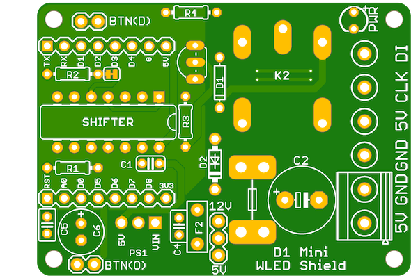

# WLED-wemos-shield
[](https://github.com/srg74/WLED-wemos-shield/blob/master/LICENSE)
[](/resources/FIRMWARE/BIN)
[](https://github.com/Aircoookie/WLED/releases)
[](https://github.com/Aircoookie/WLED-App)
## Wi-Fi LED controller based on Wemos D1 Mini for WLED firmware.

## PCB ordering
-   [Ordering](https://www.pcbway.com/project/shareproject/WLED_wemos_shield.html) - $5 for 10 PCBs very good quality.
```
Wi-Fi LED controller with following features
```
-   Easy to solder components;
-   Level shifter for relaible signal;
-   Power selector (e.g 5VDC or 12VDC);
-   Can be configured for 3 wire and 4 wire addressable LED strips;
-   Button options (depend on type of addressable LED strip);
-   Relay for power saving feature (without disconnecting power from LED strip it still consuming mA per LED even if none of LEDs is lit);

## Firmware used
-   [WLED repository](https://github.com/Aircoookie/WLED) - Main WLED repository

#### Board creation is inspired by https://github.com/Aircoookie/WLED/wiki
